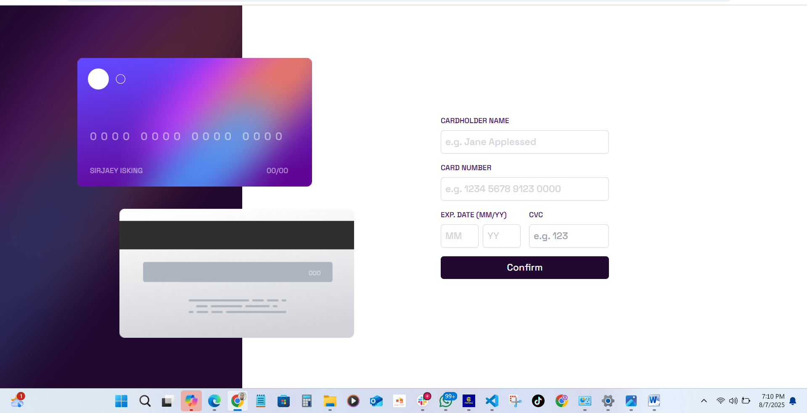
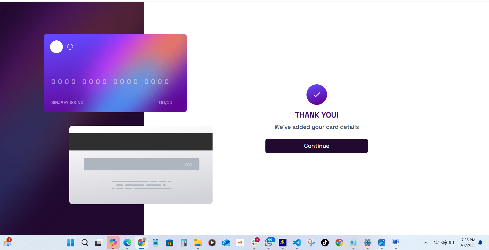

# 💳 Interactive Card Details form

This is a responsive and interactive card details form built with modern frontend tools. It allows users to input and preview their card details in real-time, validates user input, and provides a seamless experience across all screen sizes.

---

## 📌 Features

- 🔄 Real-time Preview
  - As users fill in the form, card details update live on the virtual card. 
- ❗ Form Validation. 
    Users receive clear error messages if:
    - Any input field is left empty
    - Card number, expiry date, or CVC fields are incorrectly formatted
- 📱 Responsive Layout
- 🧠 Accessible UI
- ✅ Completed State
  - On successful form submission, a completed state is displayed, with an option to reset the form and start again.

---

## 💡 Expected Behaviour

- Card details update live as the user types
- Form validates input on submission
- If all inputs are valid, a confirmation message is shown
- Clicking “Continue” on the completed state resets the form

---

## 🛠️ Technologies Used

- [React](https://reactjs.org/)
- [Tailwind CSS](https://tailwindcss.com/)

---

### 📥 Installation

1. **Clone the repository**
   ```bash
   git clone https://github.com/sirjaey/interactive-card-details
   cd interactive-card-details
   ```
2. **Install dependencies**
   ```bash
   pnpm install
   ```
3. **Start the development server**
   ```bash
   pnpm run dev
   ```
4. **Build for production**
   ```bash
   pnpm run build
   ```
5. **Preview the production build**
   ```bash
   pnpm run preview
   ```

---

## 🧰 Available Scripts & Commands

| Command           | Description                  |
| ----------------- | ---------------------------- |
| `pnpm run dev`     | Start development server     |
| `pnpm run build`   | Build the app for production |
| `pnpm run preview` | Preview built app locally    |

---

## ⚙️ Technology stack and architecture decisions

**⚙️ Tech Stack**

- React (with Hooks)

- Tailwind CSS v4

- Vite — for fast bundling and development

**🏗️ Architecture Decisions**

- Components

  - Card
  - Completed - Displays the completed state
  - ErrorBoundry
  - Form - Displays the form
  - Main

- App.jsx
- Index.css
- Main.jsx - main
- Index.css

---

## Screenshots of key features






---

## 👤 Author

- GitHub - https://github.com/sirjaey
- LinkedIn - https://www.linkedin.com/in/joshua-abu-3180b0284/
- X (Twitter) - https://x.com/sirjaey_

---

## 🔗 Links

- Live Site URL: https://joshua-abu-interactive-card-details.netlify.app/
